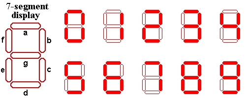

# [Seven-Segment Display][link]

You all must have seen a seven segment display.If not here it is:

Alice got a number written in seven segment format where each segment was creatted used a matchstick.

Example: If Alice gets a number 123 so basically Alice used 12 matchsticks for this number.

Alice is wondering what is the numerically largest value that she can generate by using at most the matchsticks that she currently possess.Help Alice out by telling her that number.

## Input format

First line contains T (test cases).

Next T lines contain a Number N.

## Output format

Print the largest possible number numerically that can be generated using at max that many number of matchsticks which was used to generate N.

[link]: https://www.hackerearth.com/practice/basic-programming/input-output/basics-of-input-output/practice-problems/algorithm/seven-segment-display-nov-easy-e7f87ce0/
